# 🎨 ConvNeXt × QuickDraw - Sketch Classification at Scale

<p align="center">
  
</p>

<p align="center">
  
  
  
  
  
  
</p>

---

## 🚀 Elevator Pitch

> **Applied ConvNeXt-Tiny - a state-of-the-art pure-CNN architecture - to classify 300,000 hand-drawn Google QuickDraw sketches across 30 categories.** Through 9 systematic ablation experiments (channel/size, augmentation, layer freezing, learning rate, dropout, scratch training), we achieved **87.88% test accuracy** with a pretrained model and demonstrated that training from scratch **completely eliminates overfitting** while maintaining **83.84% accuracy** - with only 10 epochs and ~28 million parameters.

### ✨ Highlights

| Achievement | Detail |
|---|---|
| 🏆 Best Test Accuracy | **87.88%** - ConvNeXt-Tiny pretrained (ImageNet-1k) |
| ⚡ Best Generalisation | **83.84%** - ConvNeXt-Tiny from scratch (no overfitting) |
| 📊 Dataset Scale | **300,000 images** across 30 classes (10,000/class) |
| 🔬 Experiments Run | **9 ablations** exploring input size, augmentation, freezing, LR, dropout |
| 🧠 Parameters | **~28 Million** trainable parameters |
| 🎯 Top Per-Class F1 | **97.55%** on `bicycle` (pretrained) |
| 📉 Lowest Test Loss | **0.5909** (scratch model) |

---

## 📋 Table of Contents

1. [Why This Matters](#-why-this-matters)
2. [What I Built](#-what-i-built)
3. [Dataset](#-dataset)
4. [Model Architecture](#-model-architecture)
5. [Training Setup](#%EF%B8%8F-training-setup)
6. [Experiments & Ablations](#-experiments--ablations)
7. [Results](#-results)
8. [Training Curves](#-training-curves)
9. [Limitations & Future Work](#-limitations--future-work)
10. [Setup & Reproducibility](#-setup--reproducibility)
11. [Tech Stack](#-tech-stack)
12. [Report & Notebooks](#-report--notebooks)

---

## 💡 Why This Matters

ConvNeXt challenges the dominance of Vision Transformers by pushing pure CNN architectures to Transformer-level performance - with simpler code, lower compute, and better scalability. Applying it to QuickDraw (50M+ doodles, 345 classes, contributed by 15M+ people) tests how well modern CNN design generalises to **noisy, sparse, artistic sketch data** - a fundamentally different distribution from natural image datasets like ImageNet.

**Key insight from this project:** Pretrained ImageNet weights, while giving higher raw accuracy, cause significant overfitting on sketch data. Training from scratch with appropriate regularisation **fully resolves overfitting** - highlighting the distribution shift between natural images and human sketches.

---

## 🛠 What I Built

- Adapted **ConvNeXt-Tiny** for single-channel (grayscale) 56×56 sketch inputs
- Ran **9 systematic experiments** comparing data pipeline, architecture, and hyperparameter choices
- Compared **pretrained (ImageNet-1k)** vs **trained-from-scratch** performance
- Performed rich **Exploratory Data Analysis**: stroke distribution, sparsity analysis, cross-class correlation heatmap
- Generated full **per-class classification reports** for all major experiments

---

## 📊 Dataset

**Google QuickDraw** - one of the world's largest doodle datasets.

| Property | Value |
|---|---|
| Total dataset size | 50M+ drawings, 345 classes |
| Subset used | **300,000 images** (30 classes × 10,000/class) |
| Format | Pre-processed 28×28 grayscale numpy `.npy` files |
| Resized to | **56×56** (upsampled for model input) |
| Normalisation | mean=0.485, std=0.229 |
| Train / Val / Test split | **70% / 15% / 15%** |

### Data Visualisation

<p align="center">
  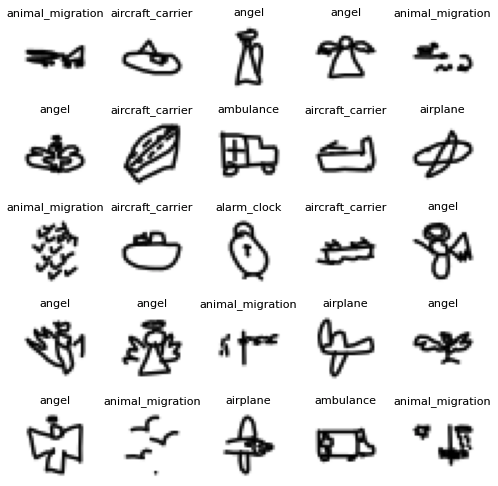
  <br/><em>Random samples from the dataset - each class has high diversity in drawing style</em>
</p>

<p align="center">
  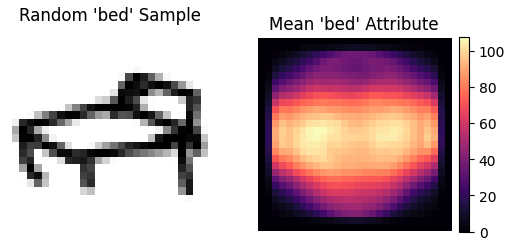
  &nbsp;&nbsp;
  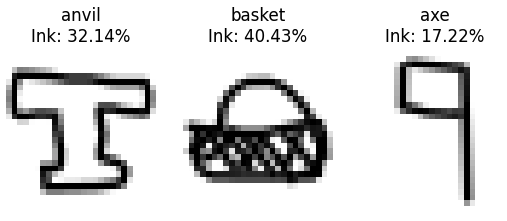
  <br/><em>Left: Mean stroke distribution for "bed" category &nbsp;|&nbsp; Right: Sparsity (non-zero pixel %) across samples</em>
</p>

<p align="center">
  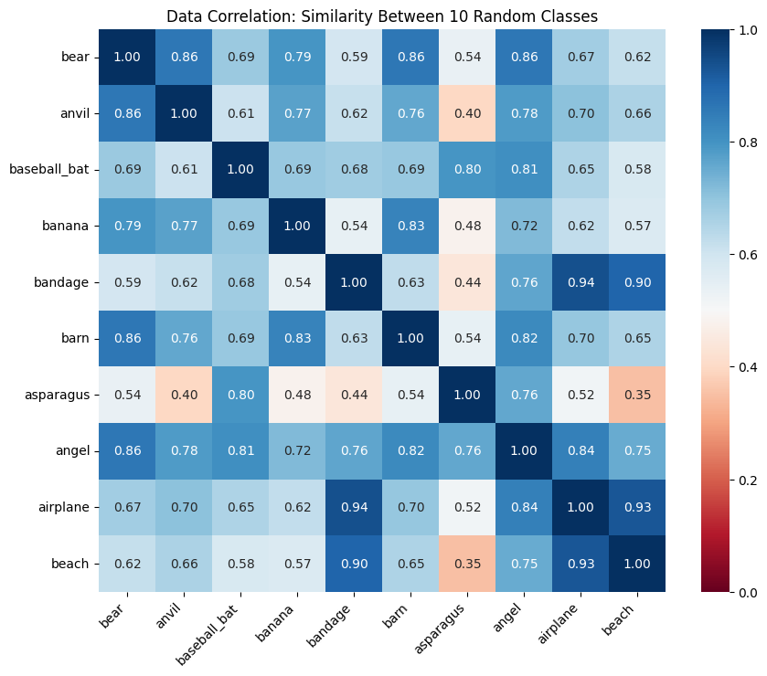
  <br/><em>Cross-class correlation heatmap - "bandage" & "airplane" show 0.94 correlation (visually similar doodles!)</em>
</p>

---

## 🧠 Model Architecture

### ConvNeXt-Tiny

ConvNeXt is a modernised ResNet - engineered by borrowing design principles from Vision Transformers while remaining a **pure CNN**. It consistently outperforms or matches ViT at similar compute.

<p align="center">
  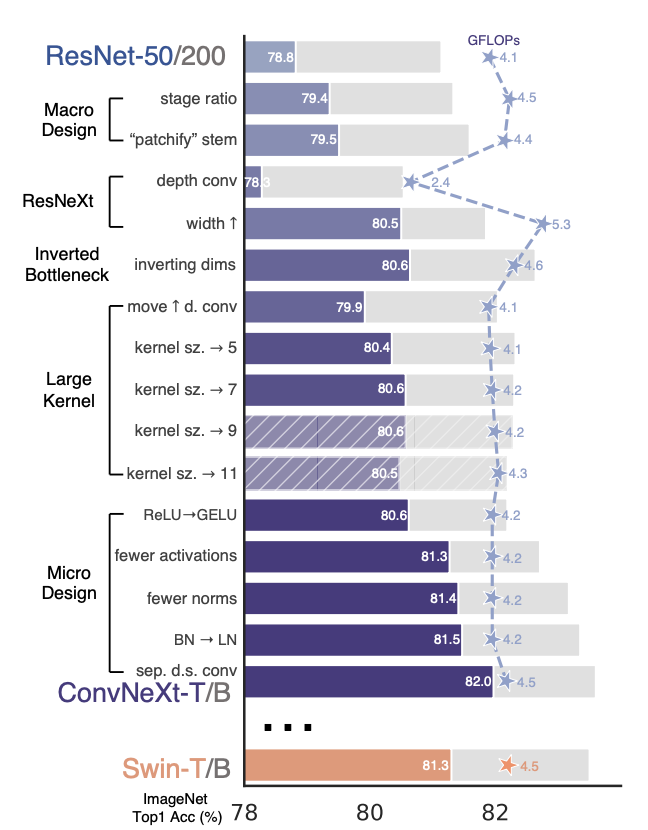
  <br/><em>Figure: Modernisation roadmap from ResNet-50 to ConvNeXt</em>
</p>

<p align="center">
  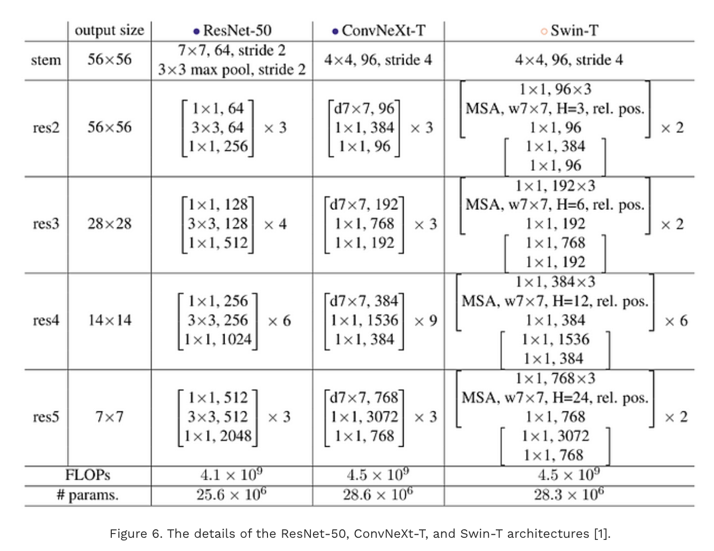
  <br/><em>Side-by-side: ResNet-50 vs ConvNeXt-T vs Swin-T</em>
</p>

<p align="center">
  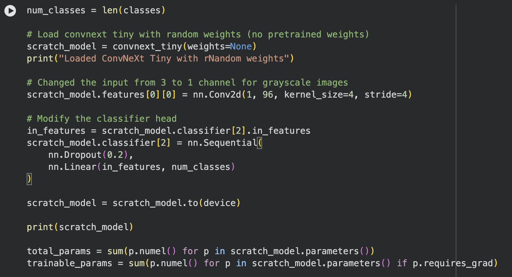
  <br/><em>Block designs: Swin Transformer, ResNet, and ConvNeXt compared</em>
</p>

#### Key Architectural Features

| Feature | ConvNeXt Change | vs ResNet |
|---|---|---|
| Stem layer | 4×4 conv, stride 4 ("patchify") | Replaces 7×7 conv + MaxPool |
| Stage ratio | (3, 3, 9, 3) | Changed from (3, 4, 6, 3) |
| Convolution | Depthwise 7×7 | Standard 3×3 |
| Activation | **GELU** | ReLU |
| Normalisation | **Layer Norm** (once per block) | Batch Norm (per conv) |
| Downsampling | Separate 2×2 conv stride-2 | Within residual block |
| Bottleneck | Inverted (expand → compress) | Standard |
| Classifier | AvgPool → Linear | AvgPool → Linear |

#### Our Modifications for QuickDraw

- **Input channels:** Changed from 3 (RGB) → **1 (grayscale)** for single-channel sketch data
- **Input resolution:** Reduced from 224×224 → **56×56** (allows 10× more images in memory)
- **Classifier head:** Added `Dropout(p=0.2)` before final `Linear(768 → 30)` to combat overfitting
- **Total trainable parameters:** ~**28 Million**

---

## ⚙️ Training Setup

| Hyperparameter | Pretrained Model | From-Scratch Model |
|---|---|---|
| Weights init | ImageNet-1k pretrained | Random (Xavier) |
| Optimiser | AdamW | AdamW |
| Learning rate | **0.0005** | **0.01** |
| Weight decay | 0.1 | 0.1 |
| LR schedule | Cosine Annealing | Cosine Annealing |
| Epochs | 10 | 10 |
| Loss function | Cross-Entropy | Cross-Entropy |
| Dropout | 0.2 | 0.2 |
| Batch size | GPU-dependent | GPU-dependent |
| Input size | 56×56 × 1ch | 56×56 × 1ch |

---

## 🔬 Experiments & Ablations

9 experiments were conducted systematically. Here's a summary of findings:

<p align="center">
  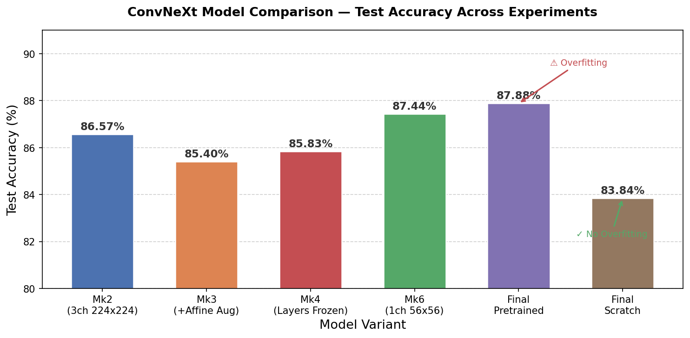
</p>

| Exp | Model | Key Change | Test Acc | Test Loss | Overfitting? |
|---|---|---|---|---|---|
| 1 | **Mk2** | 3ch 224×224, 1k imgs/class | 86.57% | - | Mild |
| 2 | **Mk3** | + Random Affine augmentation | 85.40% | - | Mild |
| 3 | **Mk4** | First 3 layers frozen | 85.83% | 0.7815 | Increased |
| 4 | **Mk6** | 1ch 56×56, 10k imgs/class | **87.44%** | 0.5938 | Yes |
| 5 | **Mk7** | LR 0.0005, WD 0.1 (vs 0.001/0.05) | - | - | Reduced |
| 6 | **Mk8** | + Dropout 0.2 | −0.03% drop | - | Still present |
| 7 | **Mk9** | Random weights (scratch) | ~83% | - | **None ✓** |
| 8 | **Final Pretrained** | 70:15:15 split, ImageNet-1k | **87.88%** | 0.6097 | **Yes** |
| 9 | **Final Scratch** | 70:15:15 split, random weights | **83.84%** | 0.5909 | **None ✓** |

**Key Findings:**
- Switching to **1-channel 56×56** (Mk6) improved accuracy from 85.83% → 87.44% and enabled 10× more training data
- **Layer freezing** slightly reduced accuracy and surprisingly increased overfitting - early layers were still learning
- **Random Affine augmentation** hurt performance on sketch data (86.57% → 85.40%)
- Training **from scratch** completely eliminates overfitting, trading ~4% accuracy for perfect generalisation

---

## 📈 Results

### Summary Table

| Model | Test Accuracy | Test Loss | Overfitting | Best Per-Class |
|---|---|---|---|---|
| **ConvNeXt-Tiny (Pretrained)** | **87.88%** | 0.6097 | ⚠️ Yes (after epoch 3) | Apple: 96.92% |
| **ConvNeXt-Tiny (From Scratch)** | **83.84%** | 0.5909 | ✅ None | Bicycle: 94.03% |

### Per-Class F1 Score Comparison

<p align="center">
  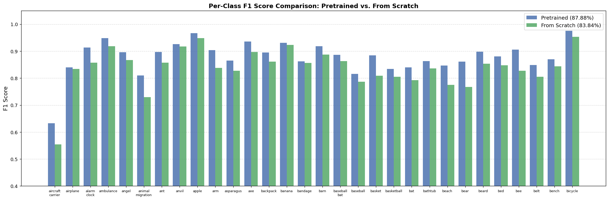
</p>

#### Pretrained Model - Full Classification Report (Test Set, 45,000 samples)

| Class | Precision | Recall | F1-Score |
|---|---|---|---|
| aircraft_carrier | 0.6616 | 0.6060 | 0.6326 |
| airplane | 0.8109 | 0.8720 | 0.8403 |
| alarm_clock | 0.9051 | 0.9220 | **0.9135** |
| ambulance | 0.9510 | 0.9453 | **0.9482** |
| angel | 0.8998 | 0.8920 | 0.8959 |
| animal_migration | 0.8252 | 0.7960 | 0.8103 |
| ant | 0.8781 | 0.9173 | 0.8973 |
| anvil | 0.9414 | 0.9107 | 0.9258 |
| apple | 0.9692 | 0.9647 | **0.9669** |
| arm | 0.9175 | 0.8900 | 0.9036 |
| asparagus | 0.8694 | 0.8613 | 0.8654 |
| axe | 0.9462 | 0.9267 | 0.9363 |
| backpack | 0.8889 | 0.9013 | 0.8951 |
| banana | 0.9134 | 0.9493 | 0.9310 |
| bandage | 0.8713 | 0.8533 | 0.8622 |
| barn | 0.9249 | 0.9113 | 0.9181 |
| baseball_bat | 0.8616 | 0.9133 | 0.8867 |
| baseball | 0.8264 | 0.8060 | 0.8161 |
| basket | 0.9006 | 0.8700 | 0.8850 |
| basketball | 0.8246 | 0.8433 | 0.8339 |
| bat | 0.8329 | 0.8473 | 0.8401 |
| bathtub | 0.8623 | 0.8640 | 0.8631 |
| beach | 0.8512 | 0.8427 | 0.8469 |
| bear | 0.8539 | 0.8687 | 0.8612 |
| beard | 0.9052 | 0.8913 | 0.8982 |
| bed | 0.8749 | 0.8860 | 0.8804 |
| bee | 0.8973 | 0.9147 | 0.9059 |
| belt | 0.8487 | 0.8487 | 0.8487 |
| bench | 0.8731 | 0.8667 | 0.8699 |
| bicycle | 0.9685 | 0.9827 | **0.9755** |
| **Overall** | **0.8785** | **0.8788** | **0.8785** |

#### From-Scratch Model - Full Classification Report (Test Set, 45,000 samples)

| Class | Precision | Recall | F1-Score |
|---|---|---|---|
| aircraft_carrier | 0.5899 | 0.5227 | 0.5543 |
| airplane | 0.8149 | 0.8540 | 0.8340 |
| alarm_clock | 0.8496 | 0.8660 | 0.8577 |
| ambulance | 0.9097 | 0.9273 | **0.9185** |
| angel | 0.8820 | 0.8520 | 0.8667 |
| animal_migration | 0.6756 | 0.7927 | 0.7294 |
| ant | 0.8828 | 0.8333 | 0.8573 |
| anvil | 0.9301 | 0.9047 | **0.9172** |
| apple | 0.9392 | 0.9573 | **0.9482** |
| arm | 0.8348 | 0.8420 | 0.8384 |
| asparagus | 0.7964 | 0.8607 | 0.8273 |
| axe | 0.8951 | 0.8987 | 0.8969 |
| backpack | 0.8655 | 0.8580 | 0.8617 |
| banana | 0.9149 | 0.9313 | 0.9230 |
| bandage | 0.8941 | 0.8220 | 0.8565 |
| barn | 0.9115 | 0.8653 | 0.8878 |
| baseball_bat | 0.8376 | 0.8907 | 0.8633 |
| baseball | 0.8557 | 0.7273 | 0.7863 |
| basket | 0.7915 | 0.8273 | 0.8090 |
| basketball | 0.7727 | 0.8407 | 0.8052 |
| bat | 0.8239 | 0.7640 | 0.7928 |
| bathtub | 0.8520 | 0.8213 | 0.8364 |
| beach | 0.8144 | 0.7400 | 0.7754 |
| bear | 0.7398 | 0.7960 | 0.7669 |
| beard | 0.8984 | 0.8133 | 0.8537 |
| bed | 0.8601 | 0.8360 | 0.8479 |
| bee | 0.7755 | 0.8867 | 0.8274 |
| belt | 0.8094 | 0.8013 | 0.8054 |
| bench | 0.8353 | 0.8520 | 0.8436 |
| bicycle | 0.9403 | 0.9660 | **0.9530** |
| **Overall** | **0.8397** | **0.8384** | **0.8380** |

---

## 📉 Training Curves

### Final Pretrained Model
<p align="center">
  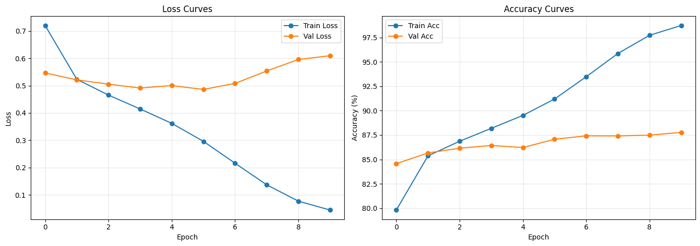
  <br/><em>Pretrained model - strong accuracy but clear overfitting after epoch 3</em>
</p>

### Final From-Scratch Model
<p align="center">
  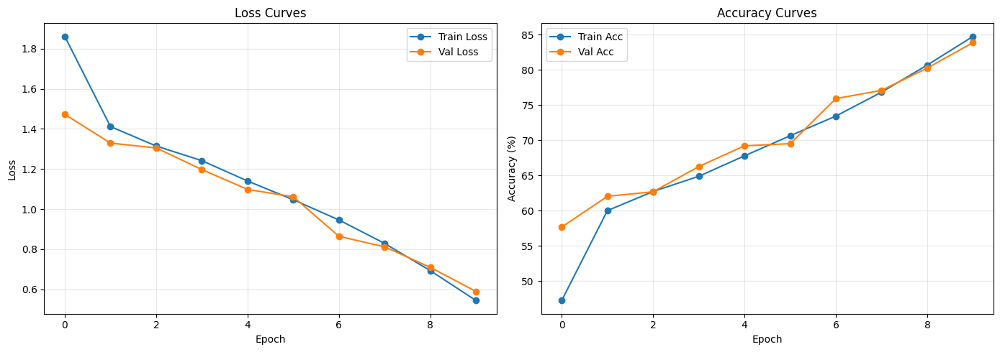
  <br/><em>Scratch model - training and validation curves closely aligned, no overfitting</em>
</p>

### Experiment Training Curves

<details>
<summary>Click to expand experiment curves (Mk3–Mk9)</summary>

**Mk3** (no layer freezing, Random Affine):
<p align="center">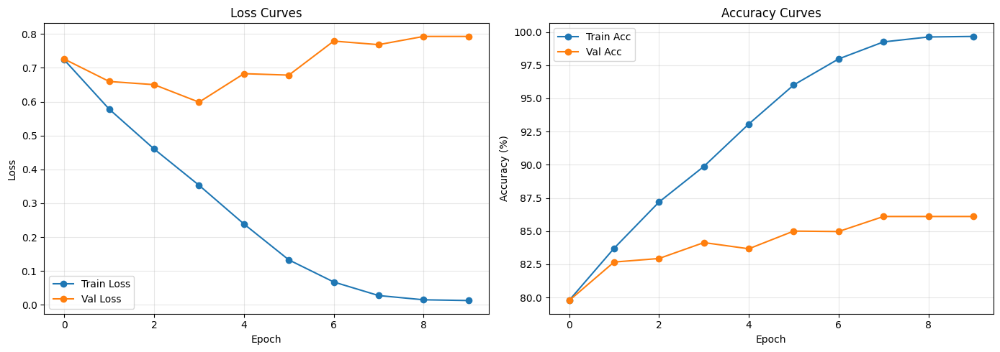</p>

**Mk4** (first 3 layers frozen):
<p align="center">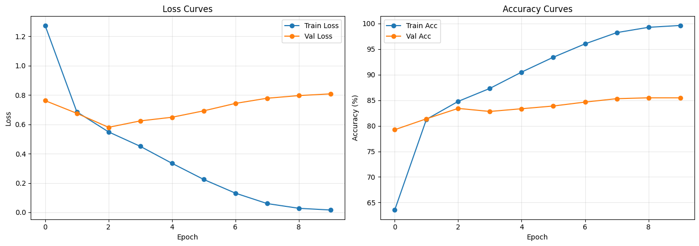</p>

**Mk6** (1ch 56×56, 10k imgs/class):
<p align="center">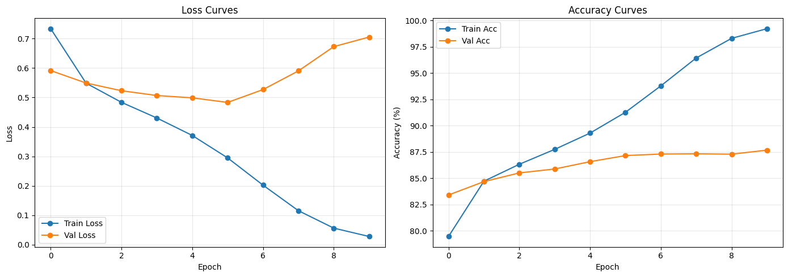</p>

**Mk7** (LR 0.0005, WD 0.1):
<p align="center">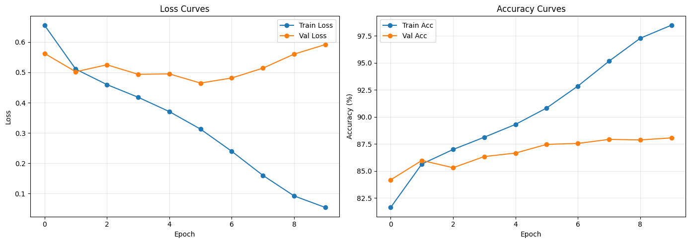</p>

**Mk8** (+ Dropout 0.2):
<p align="center">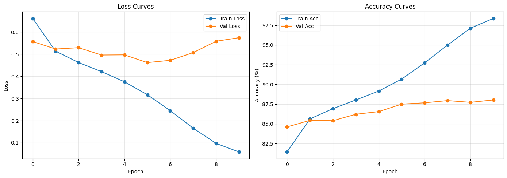</p>

**Mk9** (From scratch - first attempt):
<p align="center">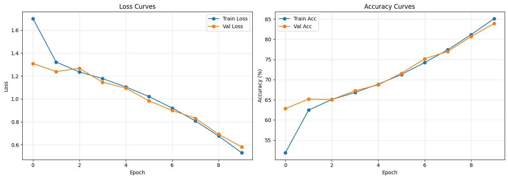</p>

</details>

---

## 🚧 Limitations & Future Work

- **Hardware constraints** limited training to 10 epochs and 30 classes (300k samples); with more compute, training on all 345 classes with 50M samples could push accuracy significantly higher
- **K-fold cross-validation** was attempted but not completed due to memory limitations
- **More epochs** on the scratch model are expected to close the ~4% gap with the pretrained model
- **Larger dataset subsets** per class (>10,000 samples) may further improve generalisation
- **Ensemble methods** or **test-time augmentation** could be explored to boost accuracy

---

## ⚡ Setup & Reproducibility

### Requirements

```bash
pip install torch torchvision numpy matplotlib scikit-learn jupyter
```

### Data Download

Download the QuickDraw `.npy` files for each class from the [official QuickDraw dataset](https://github.com/googlecreativelab/quickdraw-dataset#get-the-data):

```bash
# Example: download first 30 classes
gsutil -m cp "gs://quickdraw_dataset/full/numpy_bitmap/*.npy" ./data/
```

### Run Notebooks

```bash
# Main training and evaluation notebook
jupyter notebook final_notebook.ipynb

# Experiment notebooks (in order)
jupyter notebook experiments/convNext-mk1.ipynb   # baseline
jupyter notebook experiments/convNext-mk2.ipynb
# ... through mk9
jupyter notebook experiments/convNext-comparision.ipynb  # final comparison
```

### Project Structure

```
ConvNext-Quickdraw/
├── final_notebook.ipynb          # Main notebook: pretrained vs scratch comparison
├── experiments/
│   ├── convNext-mk1.ipynb        # Baseline
│   ├── convNext-mk2.ipynb        # 3ch 224x224
│   ├── convNext-mk3.ipynb        # + Random Affine
│   ├── convNext-mk4.ipynb        # Layer freezing
│   ├── convNext-mk5.ipynb        # Additional experiment
│   ├── convNext-mk6.ipynb        # 1ch 56x56 (key improvement)
│   ├── convNext-mk7.ipynb        # LR tuning
│   ├── convNext-mk8.ipynb        # Dropout
│   ├── convNext-mk9.ipynb        # From scratch
│   ├── convNext-comparision.ipynb
│   └── main-v1.ipynb
├── submitted_docs/
│   ├── CS6482-Assign1-25141104-25165933.pdf    # Full report (PDF)
│   ├── CS6482-Assign1-25141104-25165933.docx   # Full report (DOCX)
│   └── CS6482-Assign1-25165933-25141104.ipynb  # Submitted notebook
├── assets/                       # Figures and charts for README
└── 2201.03545v2.pdf              # ConvNeXt original paper
```

---

## 🛠 Tech Stack

| Category | Tool/Library |
|---|---|
| Deep Learning | PyTorch, TorchVision |
| Model | ConvNeXt-Tiny (`torchvision.models.convnext_tiny`) |
| Data | Google QuickDraw (`.npy` numpy bitmap format) |
| Preprocessing | NumPy, TorchVision Transforms |
| Evaluation | scikit-learn (`classification_report`) |
| Visualisation | Matplotlib |
| Notebook | Jupyter Notebook / Google Colab |
| Hardware | NVIDIA RTX 3050 6GB + AMD Ryzen 9 5900HS, 32GB RAM |

---

## 📄 Report & Notebooks

| Resource | Link |
|---|---|
| 📓 Final Comparison Notebook | [final_notebook.ipynb](final_notebook.ipynb) |
| 📚 ConvNeXt Paper | [2201.03545v2.pdf](2201.03545v2.pdf) |

---

## 👥 Authors

**Jai Parakh** · **Simran Kukreja**  
MSc in Artificial Intelligence and Machine Learning - Sem 2 AY 25/26  
*CS6482 Deep Reinforcement Learning - Assignment 1*

---

<p align="center">
  <em>Built with ❤️ and a lot of doodles 🎨</em>
</p>
